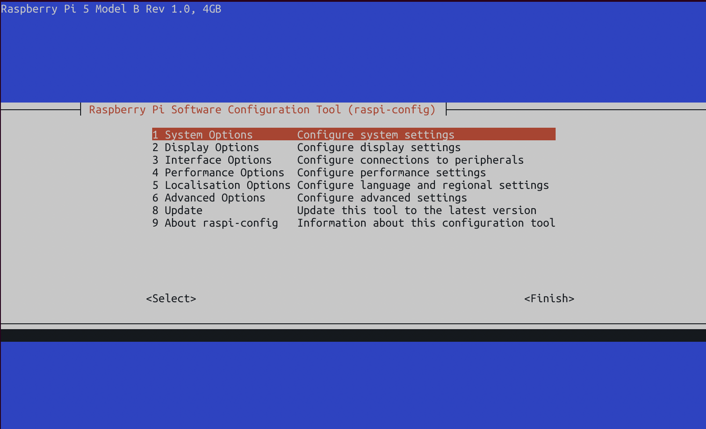
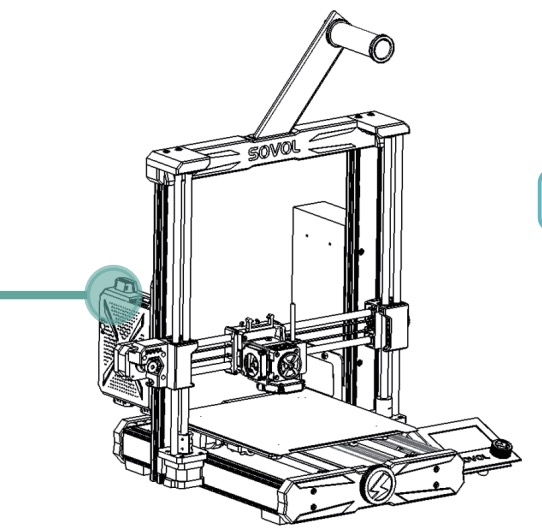
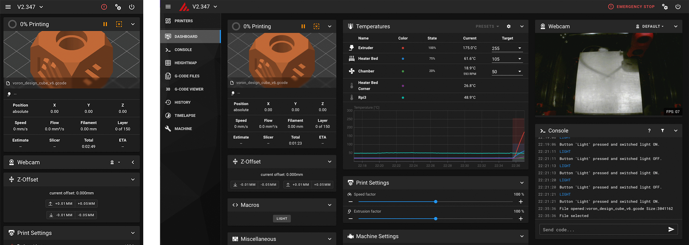

# Guía: Configurar la Raspberry Pi y la Impresora

## Paso 1: Conectar la Raspberry Pi a WiFi

### 1. Alimentar y Conectar la Raspberry Pi

- Conecta el adaptador de corriente a la Raspberry Pi y enciéndela.
- Conecta un cable ethernet desde la Raspberry Pi a tu módem.

### 2. Instalar PowerShell en Tu Portátil

- Instala Microsoft PowerShell siguiendo [esta guía](https://learn.microsoft.com/en-us/powershell/scripting/install/installing-powershell?view=powershell-7.4).

### 3. Configurar la Raspberry Pi

- Abre PowerShell en tu portátil.
- Asegúrate de que la Raspberry Pi esté encendida y conectada al módem con el cable ethernet.
- En PowerShell, escribe el siguiente comando y presiona Enter:
  ```bash
  sudo raspi-config
  ```

### 4. Configurar la Conexión WiFi

- Verás una pantalla de configuración como esta:



- Navega a `System Options -> Wireless LAN`, e introduce la información de tu red WiFi.

### 5. Finalizar la Configuración

- Selecciona `Finish`.
- Escribe:
  ```bash
  sudo shutdown
  ```
- Espera 30 segundos, luego desconecta la Raspberry Pi de la corriente y del cable ethernet.

---

## Paso 2: Conectar la Raspberry Pi a la Impresora

### 1. Conectar la Raspberry Pi a la Impresora

- Utiliza un **cable USB a micro USB** para conectar la Raspberry Pi a la impresora.

  - **Importante**: Debería haber cinta aislante en el lado USB A (la parte que se conecta a la Raspberry Pi). Esto es para evitar que la impresora suministre corriente a la Pi. Si falta la cinta, sigue [esta guía](https://github.com/bassamanator/everything-sovol-sv06/blob/main/howto.md#disable-usb-cable-5v-pin) para solucionarlo.

  

### 2. Encender la Impresora

- Enciende la impresora usando su interruptor de encendido.

### 3. Acceder a la Interfaz de la Impresora

- En tu portátil o teléfono, ve a `http://sovol.local`.

Deberías ver una interfaz web como esta:



---

## Paso 3: Probar la Impresora

### Hacer Home a la Impresora

Una vez que la interfaz se cargue correctamente, estarás listo para imprimir. Antes de imprimir, puedes probar la impresora haciéndole "home". Esto le indica a la impresora dónde se encuentra el sistema de movimiento.

### Qué Sucede al Hacer Home:

- Presiona el botón `Home` o escribe `G28` en la consola.
- La impresora moverá el cabezal hacia la izquierda hasta que toque suavemente el lado izquierdo.
- La cama se moverá hacia la parte trasera y tocará suavemente el fondo.
- Después de estos movimientos, el cabezal se posicionará en el centro de la cama de impresión.

**Importante**: No intentes mover el cabezal o la cama manualmente mientras los motores paso a paso estén activos, ya que esto podría desalinear la impresora.
